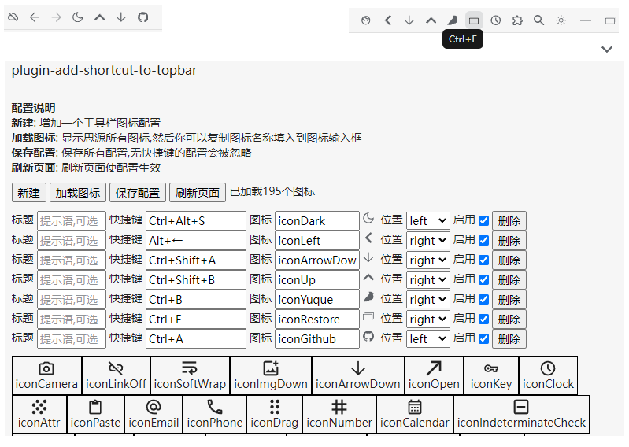

# siyuan plugin  add-shortcut-to-topbar

## 功能

在工具栏(顶栏)的左右两边添加图标按钮,一个图标对应一个快捷键,点击图标即可执行对应的快捷键

## 使用说明

1. 启用插件后点击顶栏的插件图标进入配置页面
2. 配置页面有4个按钮,其顺序正是配置的流程
   1. 点击`新建`,增加一个配置
      1. 在快捷键输入框里按下快捷键,配置会显示快捷键的字符串, 必填项
   2. 点击`加载图标`,会显示思源中已加载的所有图标,点击图标名字即可复制,然后填入到配置的图标输入框内
   3. 点击`保存配置`,保存更改
   4. 点击`刷新页面`,重新加载思源,查看修改后的效果
3. 其它按钮功能
   - `重置配置`: 删除插件的本地配置文件,以重置

## 更新日志

### 1.1.2 @ 24-05-17 修bug
### 1.1.1 @ 24-05-16 修bug
### 1.1.0 @ 24-05-15
大改

- 支持编辑器工具栏
- 支持通过拖动自定义顺序
-

### 1.0.1  @ 24-04-30

初始版本
